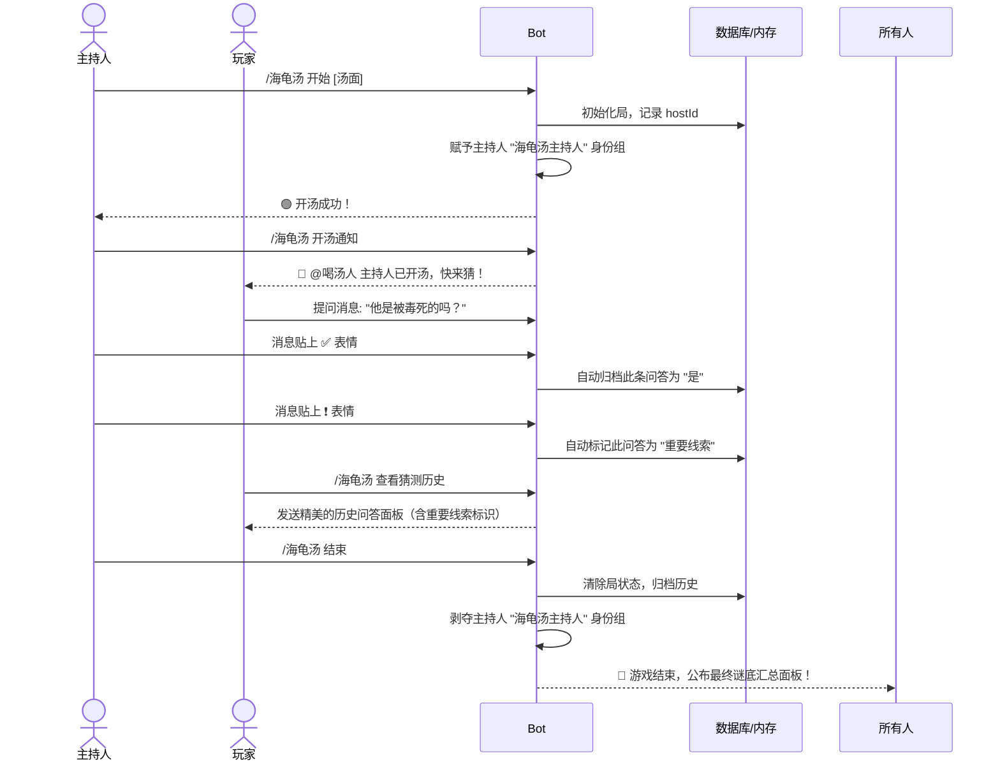

# 集成海龟汤（Turtle Soup）游戏功能实现计划

该计划旨在向 `handle-discord-bot` 中集成海龟汤游戏。海龟汤是一款情境推理游戏，由主持人（汤主）发布谜面（汤面），玩家（喝汤人）通过提问（Bot 通过表情判定并记录提问历史）来解开谜底。

## 方案设计核心亮点（第一性原理）

1. **自动 Reaction 归档（无感操作）**：
   主持人无需右键菜单或输入命令，只需在 Discord 中直接对玩家的提问进行 Emoji 表态，Bot 即可自动记录：
   * `✅` (`:white_check_mark:`) ➡️ **是**
   * `❌` (`:x:` 或 `:cross_mark:`) ➡️ **不是**
   * `⭕` (`:o:`) ➡️ **是也不是**
   * `🚫` (`:no_entry_sign:` 或 `:prohibited:`) ➡️ **无关**
   * `📌` (`:pushpin:`) ➡️ **标注消息**（无对错判定，仅划重点）

2. **感叹号标记重要消息 (`❗` 或 `‼️`)**：
   * 如果消息既有**有意义的表情**（上述 5 种之一）又有**感叹号**，Bot 会将其归档为**重要线索**。
   * 如果消息**仅有感叹号**，不进行归档。

3. **双轨持久化方案（PostgreSQL 自动连接 + 内存降级）**：
   考虑到 Render 平台的临时文件系统特性，我们设计了**自动侦测的数据库引擎**：
   * 如果 `.env` 中配置了 `DATABASE_URL`，Bot 会自动连接 PostgreSQL 并创建数据表，实现跨重启持久化。
   * 如果未配置或连接失败，Bot 会自动降级为**内存存储**，确保在任何环境下都能立即无错运行。

4. **严谨的权限与身份组代理**：
   * 开汤时自动赋予主持人 `海龟汤主持人` 身份组，结汤时自动剥夺，保持服务器整洁。
   * 提供 `/海龟汤 开汤通知` 命令，由 Bot 代理艾特 `喝汤人` 玩家组，防止恶意刷屏骚扰。

---

## 拟引入的依赖与配置修改

### 1. [MODIFY] [package.json](file:///e:/%E6%B8%B8%E6%88%8F%E6%96%87%E6%A1%A3/%E9%85%92%E9%A6%86/antigravity/handle/handle/package.json)
引入 PostgreSQL 客户端库：
```json
"dependencies": {
  "pg": "^8.11.3",
  ...
},
"devDependencies": {
  "@types/pg": "^8.11.2",
  ...
}
```

### 2. [MODIFY] [src/index.ts](file:///e:/%E6%B8%B8%E6%88%8F%E6%96%87%E6%A1%A3/%E9%85%92%E9%A6%86/antigravity/handle/handle/src/index.ts)
* 引入 `GatewayIntentBits.GuildMessageReactions` 以启用 Reaction 监听。
* 启用 `Partials.Message`、`Partials.Reaction` 和 `Partials.User`，保证 Bot 重启后仍能监听到历史消息的 Reaction 变化。
* 挂载 Reaction 添加与移除的事件监听器。

---

## 新增文件设计

### 1. [NEW] [soup-db.ts](file:///e:/%E6%B8%B8%E6%88%8F%E6%96%87%E6%A1%A3/%E9%85%92%E9%A6%86/antigravity/handle/handle/src/game/soup-db.ts)
数据库/内存双轨存储管理器，负责在底层透明地读写海龟汤数据。

### 2. [NEW] [soup-reactions.ts](file:///e:/%E6%B8%B8%E6%88%8F%E6%96%87%E6%A1%A3/%E9%85%92%E9%A6%86/antigravity/handle/handle/src/game/soup-reactions.ts)
专门用于处理表情监听器的逻辑模块（`messageReactionAdd` 和 `messageReactionRemove`）。

### 3. [NEW] [soup.ts](file:///e:/%E6%B8%B8%E6%88%8F%E6%96%87%E6%A1%A3/%E9%85%92%E9%A6%86/antigravity/handle/handle/src/commands/soup.ts)
`/海龟汤` 主命令及子命令的实现：
* `/海龟汤 开始 [汤面]`
* `/海龟汤 查看汤面`
* `/海龟汤 查看猜测历史`
* `/海龟汤 开汤通知`
* `/海龟汤 结束`

---

## 详细命令交互逻辑



---

## 验证计划

### 1. 自动化与构建测试
* 运行 `npm run build` 确保 TypeScript 编译成功。
* 编写测试引擎验证 Postgres 降级内存的逻辑。

### 2. 手动功能验证（Bot 部署后）
* **开汤测试**：输入 `/海龟汤 开始`，验证是否被赋予身份组、重复开局是否被阻止。
* **通知测试**：输入 `/海龟汤 开汤通知`，检查是否正确艾特了 `喝汤人` 身份组且不干扰普通成员。
* **表情监听测试**：
  * 主持人对玩家消息贴上 `✅`、`❌`、`⭕`、`🚫`、`📌`，然后输入 `/海龟汤 查看猜测历史` 验证是否成功录入。
  * 主持人添加/移除 `❗` 或 `‼️`，检查猜测历史中该项的“重要”标识是否实时同步。
  * 主持人移除核心表情，检查对应的猜测记录是否被清除。
* **结汤测试**：输入 `/海龟汤 结束`，验证是否自动剥夺主持人身份组并清理状态。
